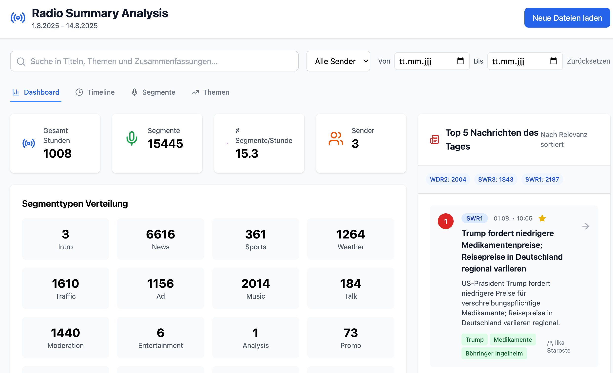

# Radiomining — Radio-Summary Webapp

<p align="center">
  
</p>

Dieses Repository enthält eine Prototyp-Webanwendung zur Durchsicht und Visualisierung von automatisch erzeugten Radiosendungs-Zusammenfassungen ("summaries"). Die Zusammenfassungen werden mit dem enthaltenen Python-Tooling erzeugt und basieren auf Transkripten, die zuvor mit einer vorgelagerten Audio-Pipeline (z. B. `audio_miner`) erstellt wurden.

## Kurze Projektbeschreibung

- Die Rohtranskripte (z. B. `final_batch.zip`) werden in einer Vorpipeline erzeugt (Audio → Transkript).
- Mit dem Python-CLI (`radiomining.cli`) werden die Transkripte vorverarbeitet und dann in Anfrage-Prompts an die OpenAI-API geschickt, um Zusammenfassungen zu erzeugen.
- Aus Kosten- und Testgründen wurden nicht alle Monate zusammengefasst: aus einem 4‑Monats-Korpus wurden für die Demonstration 14 Tage ausgewählt (01.08.2025–14.08.2025).
- Die erzeugten Summaries für die Webapp liegen in `summaries.zip` (oder in `./data/out` nach dem Ausführen des Summarize-Workflows).

## Wichtige Befehle (Preprocessing & Summarize)

Die folgenden Befehle wurden verwendet, um die Anfragen an die OpenAI-API vorzubereiten und die Summaries zu erzeugen (Beispiel: Auswahl 01.08.2025–15.08.2025, rekursiv über `final_batch`):

1) Preprocessing (erzeugt Prompt-Dateien und extrahiert Metadaten):

```bash
PYTHONPATH=src \
python -m radiomining.cli preprocess \
  ./data/final_batch \
  --tz Europe/Berlin \
  --start "2025-08-01T00:00" \
  --end   "2025-08-15T00:00"  \
  --recursive
```

2) Summarize (sendet die Anfragen an OpenAI und schreibt die Ergebnisse nach `./data/out`):

```bash
PYTHONPATH=src \
python -m radiomining.cli summarize \
  --path ./data/out \
  --model gpt-5-nano \
  --tz Europe/Berlin \
  --start "2025-08-01T00:00" \
  --end   "2025-08-15T00:00"
```

> Hinweis: Die oben gezeigten Zeitintervalle sind halb-offen; das `--end`-Datum in den Beispielen ist inklusive des Tagesbeginns am 15.08 (d.h. für 14 volle Tage: 01.08 00:00 — 15.08 00:00).

## Verwendete Modelle & Kostenentscheidungen

- Die Zusammenfassungen in diesem Projekt wurden mit `gpt-5-nano` erzeugt, um die Kosten zu begrenzen. Deshalb wurde aus einem größeren Transkript-Korpus nur ein 14-Tage-Zeitraum ausgewählt (01.08.–14.08.2025).
- Der Befehl, der konkret für die Sammlung der Summaries verwendet wurde, ist weiter oben unter "Summarize" dokumentiert.

## Hinweise zu Qualität und Limitationen

- Die Webapp präsentiert Ergebnisse, die von einem Chat-basierten LLM stammen. Solche Modelle können inhaltliche Unsicherheiten oder Übergeneralisationen erzeugen. Bitte betrachten Sie die Ausgaben als assistive Zusammenfassungen und prüfen Sie kritische Fakten in den Originaltranskripten.
- Vor dem Einsatz wurde ein prototypischer Ansatz mit klassischen Transformer-basierten Ansätzen (BERT / sentence-BERT / ähnliche rekonstruktive Embedding-Merges) getestet. Dieser Ansatz war für unsere Anforderungen nicht so erfolgreich wie die LLM-basierten Prompts und wurde verworfen. Gründe waren u. a. schlechtere thematische Kohärenz und aufwändigere Heuristik für Zusammenfassungsaggregation.

## ZIP-Dateien

- `final_batch.zip` — enthält die Rohtranskripte aus der vorgelagerten Audio-Pipeline (Audio → Transkript). Verwenden Sie dieses Archiv als Input für `radiomining.cli preprocess`.
- `summaries.zip` — enthält die bereits erzeugten JSON-Zusammenfassungen, wie sie in `./data/out` abgelegt werden. Dieses Archiv kann direkt in die Webapp geladen oder entpackt nach `./data/out` kopiert werden.

## Webapp starten (Frontend)

Die Webapp ist eine kleine React-App mit Vite. Die wichtigsten npm-Skripte sind in `package.json` hinterlegt:

- Entwicklung (lokaler Dev-Server):

```bash
npm install
npm run dev
# öffne danach im Browser: http://localhost:5173
```

- Produktion-Build und Vorschau:

```bash
npm run build
npm run preview
# Vorschau: öffne den im Terminal angezeigten URL (standardmäßig http://localhost:4173)
```

Die App ist unter `src/gui` organisiert; der Einstiegspunkt ist `src/gui/main.jsx`.

## Python-Umgebung

Für die Python-CLI steht eine Conda-Umgebung in `environment.yml`. Ein schneller Weg, die Umgebung zu erstellen:

```bash
conda env create -f environment.yml
conda activate radiomining
```

Alternativ können Sie auch ein Virtualenv/Python 3.11 verwenden und die pip-Pakete aus der `environment.yml` installieren (z. B. `openai`, `python-dotenv`, `pandas`, `typer`, `rich`).

Wichtig: Das Projekt verwendet die offizielle OpenAI-Python-Bibliothek (`openai`), und `src/radiomining/openai_client.py` importiert `OpenAI` aus dieser Bibliothek. Stellen Sie sicher, dass Sie einen gültigen OpenAI API-Key in Ihrer Umgebung (z. B. via `.env`) setzen, bevor Sie `radiomining.cli summarize` ausführen.

## Beispiel-Workflow (Kurz)

1. Rohtranskripte bereitstellen (entpacke `final_batch.zip` nach `./data/final_batch`).
2. Preprocess ausführen (siehe oben) — es werden Prompt-Dateien und Metadaten erzeugt.
3. Summarize ausführen — die Anfragen an die OpenAI-API werden gesendet, Ergebnisse landen in `./data/out`.
5. Frontend starten (`npm run dev`) und `summaries.zip` oder `./data/out` in der Webapp laden.