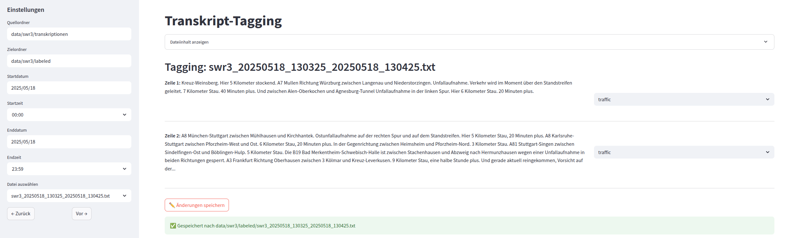

# Transkript-Tagging Tool

Dieses Tool ermöglicht das komfortable Durchsuchen und Taggen von Transkript-Dateien („.txt“) anhand von Zeitintervallen und vordefinierten Kategorien.



> **Abbildung:** Beispiel einer laufenden Anwendung (Streamlit UI).

## Features

- Filterung von Transkript-Dateien nach Start- und Endzeitpunkt
- Navigation zwischen gefundenen Dateien
- Anzeigen des Datei-Inhalts und Vorbefüllung bereits gelabelter Dateien
- Freie Auswahl von Tags pro Zeile (skip, news, traffic, weather, moderation, advertisement, music)
- Direkte Speicherung der Änderungen in einen Zielordner

## Voraussetzungen

- Python 3.8+
- Streamlit

## Installation

Streamlit muss installiert sein, um die Anwendung auszuführen:

```bash
pip install streamlit
```

## Verwendung

Das Tool wird über die Kommandozeile gestartet. Unten ein Beispiel:

```bash
streamlit run src/analyze/label_app.py -- \
  --input_folder data/swr3/transkriptionen \
  --output_folder data/swr3/labeled \
  --start_date 2025-05-18 \
  --end_date 2025-05-18
```

### Parameter

| Parameter         | Beschreibung                                                       |
|-------------------|---------------------------------------------------------------------|
| `--input_folder`  | Pfad zum Ordner mit den unbearbeiteten Transkript-Dateien (`.txt`) |
| `--output_folder` | Pfad zum Ordner, in dem gelabelte Dateien gespeichert werden       |
| `--start_date`    | Filter: Zeige nur Dateien mit Startdatum ab diesem Datum (YYYY-MM-DD) |
| `--end_date`      | Filter: Zeige nur Dateien mit Enddatum bis zu diesem Datum (YYYY-MM-DD) |

Hinweis: Wenn Sie Start- und Endzeit in der Streamlit-Sidebar einstellen, überschreiben diese Eingaben die Kommandozeilenparameter.

## Ablauf

1. **Start**: Anwendung in der Konsole starten.  
2. **Filter**: In der linken Sidebar Quell- und Zielordner sowie Datums- und Zeitbereich einstellen.  
3. **Auswahl**: Aus der gefilterten Liste eine Datei auswählen oder mit den Pfeil-Buttons navigieren.  
4. **Inhalt anzeigen**: Über den Expander den vollständigen Text einsehen.  
5. **Tagging**: Jede Zeile erhält einen vorbefüllten Tag, falls bereits gelabelt. Tags können angepasst werden.  
6. **Speichern**: Änderungen per Klick auf **✏️ Änderungen speichern** sichern.

## Tags

- `skip` (Standard)  
- `news`  
- `traffic`  
- `weather`  
- `moderation`
- `advertisement`
- `music`